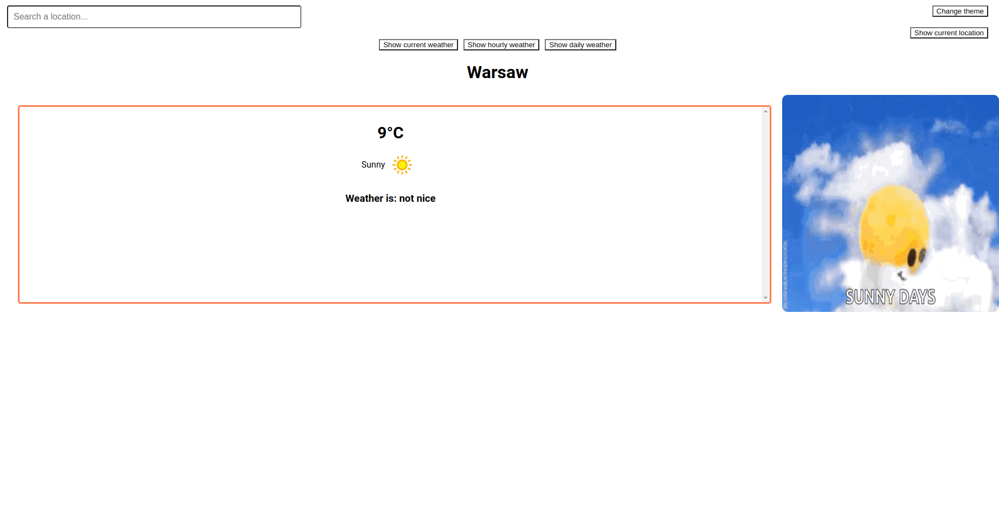
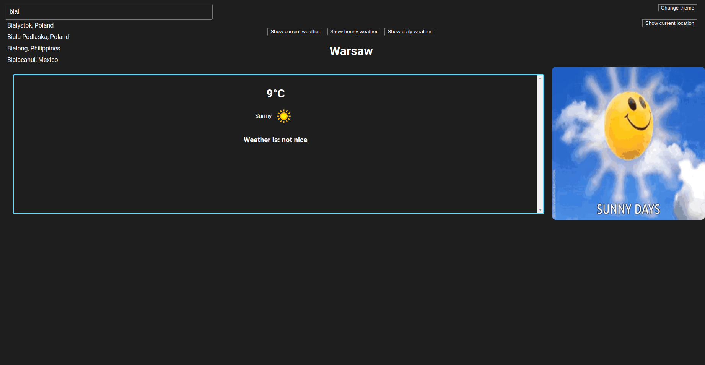
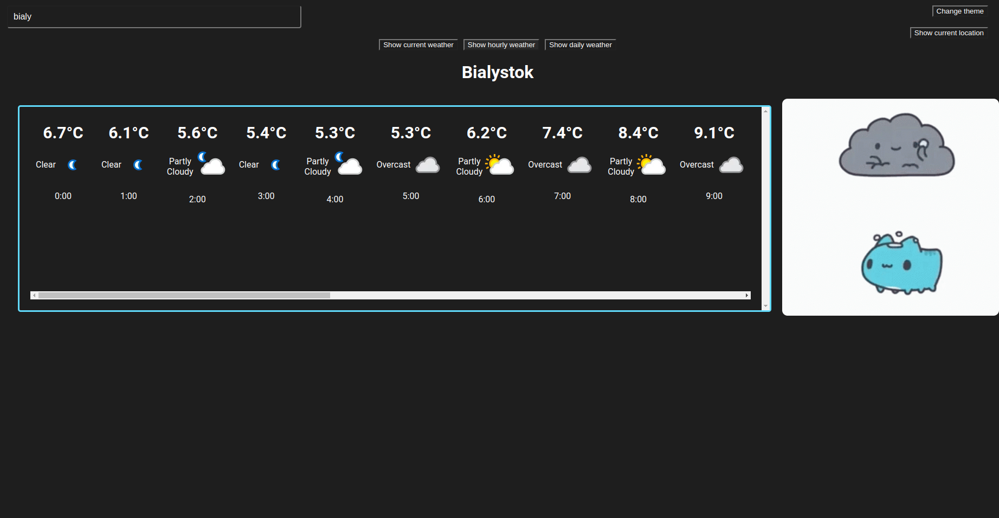
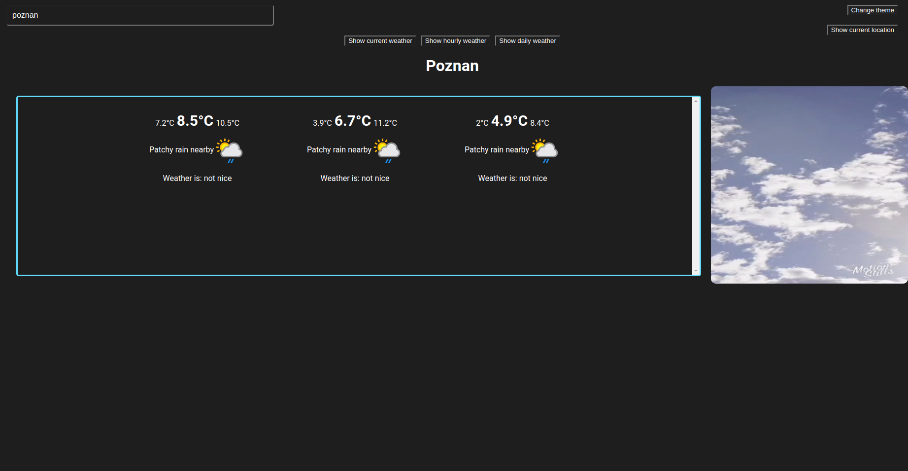

This project is a modified project from my another repo.
The original project uses redux store, this is written in pure react.

## Run the project
1. Clone the project
2. Run `npm install`
3. Run `npm start`
4. If does not work, install required packages manually.

